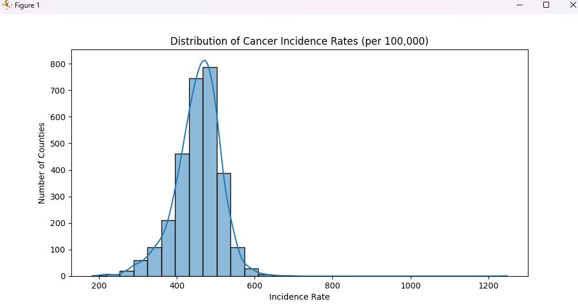
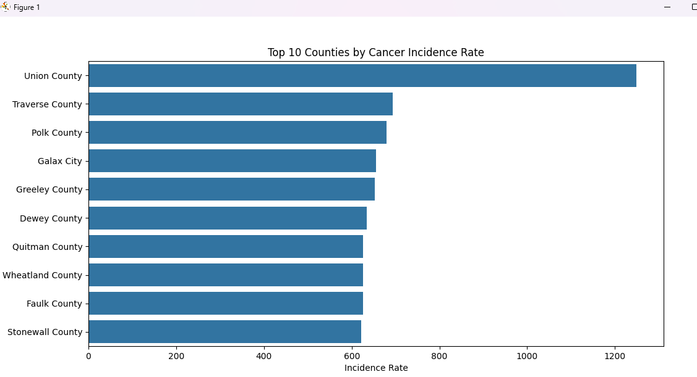
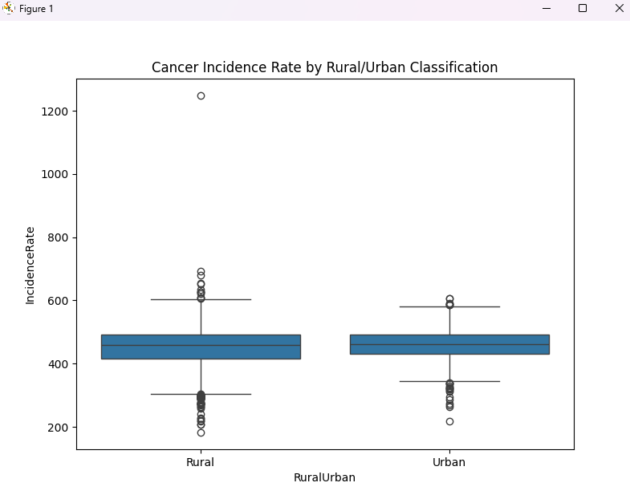

# AML_project

## Data Collection
1. Cancer rates data: https://statecancerprofiles.cancer.gov/incidencerates/index.php
    - go to site, select united states, by county, and include all parameter choices
2. 

## Cancer Dataset
- datacleaning:
     - cleaned numerical columns
     - dropped irrelevant columns
     - cleaned county and state columns to remove excess str
     - dropped missing incidence rate rows
     - renamed columns with shorter names

- data visualization

distribution of rates

top 10 counties by rates

boxplot of rural vs city distribution

## Air Dataset
- datacleaning:
    - replaced null values with 0
    - made categories numerical